深圳大学本科生生课程论文

1\.系统建模

对于机器人的平衡，纵向以及转向运动，可以将模型简化为三维空间中的类一阶倒立摆模型，即忽略腿长的变化，转向运动由两个驱动轮差速运动控制。

1\.1模型定义

称机器人机体质心到两个驱动轮转轴中心的连线为摆杆，得到如图1所示平衡车模型。

该模型的变量与参数定义如表1、表2所示。

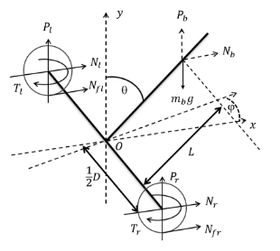

图1 平衡车模型

表1 平衡车模型变量定义

|符号|含义|正方向|单位|
| :-: | :-: | :-: | :-: |
|q|摆杆与竖直方向夹角|图示为正方向|rad|
|j|摆杆偏航角|图示为正方向|rad|
|xi|驱动轮位移|X轴正方向|m|
|xb|机体位移|X轴正方向|m|
|Pi|驱动轮对摆杆力的竖直分量|箭头所示|N|
|Pb|摆杆受到的竖直方向力|箭头所示|N|
|Ni|驱动轮对摆杆力的水平分量|箭头所示|N|
|Nb|摆杆受到的水平方向力|箭头所示|N|
|Ti|驱动轮输出力矩|箭头所示|N·m|

表2 平衡车模型参数定义

|符号|单位|含义|
| :-: | :-: | :-: |
|D|m|车体转向直径|
|R|m|驱动轮半径|
|L|m|摆杆质心到驱动轮转轴中心的直线长度|
|mw|kg|驱动轮质量|
|mb|kg|摆杆质量|
|Ib|kg∙m2|摆杆绕质心关于Z轴的转动惯量|
|Iw|kg∙m2|驱动轮转子转动惯量|
|Iz|kg∙m2|整车质心关于Y轴的转动惯量|

1\.2 经典力学分析

对驱动轮，有：

mwxi=Nfi-Ni#1

IwxiR=Ti-NfiR#2

对摆杆，有：

mbxb=Nfl+Nfr#3

mbyb=Pr+Pl-mbg#4

Ib*q*b=Pr+PlLsin*q*b-Nr+NlLcos*q*b-Tr+Tl#5

对整车，有：

Izϕ=D2Nl-Nr#6

其中：

xb=x+Lsin*q*b#7

yb=Lcos*q*b#8

1\.3 状态空间模型

`    `定义非线性模型：

x=fx,Tl,Tr

利用*MATLAB*符号运算工具，联立式（1）到式（8），通过函数solve对方程组消去中间变量，最终得到非线性表达式（9），式（10），和式（11）

2mwx+mbx-Lsin*q*b*q*b2-*q*bcos*q*b-TlR-TrR+2IwxR2=0#9

Tl+Tr+Ib*q*b-Lsin*q*bgmb-Lmbcos*q*b*q*b2+*q*bsin*q*b-2Lmwxcos*q*b

+LTlcos*q*bR+LTr\*cos*q*bR-2IwLxcos*q*bR2=0#10

DTlR=mwϕbD2R2+IwϕbD2+TrDR+2IzϕbR2#11

定义状态向量x与控制向量u分别为：

x=xx*q*b*q*bϕϕ, u=TlTr

根据式状态向量x与控制向量u，求非线性模型在平衡点处的雅可比矩阵并对其线性化，即将*q*=0，则sin*q*=*q*,cos*q*=1代入式（9）到（11）后，求：

A=∂f∂xx,u, B=∂f∂ux,u

其中，x、u是系统平衡点，即方程fx,  u=0的解：

x=xb000ϕb0, u=00

最终求得的状态方程为：

x=01000000A1A20000010000A3A400000001000000x+00B1B200B3B400B5B6u#12

由于表达式略为复杂，此处用符号代替，具体内容可通过运行MATLAB代码在工作空间中查看。

所有变量均可通过平衡车上各个传感器（如驱动轮编码器，IMU模块等）直接测量或通过数据融合解算得到，故可得系统输出y=I6x，其中I6为单位阵。

代入平衡车实车模型参数后可以得到该状态空间模型的状态矩阵A和控制矩阵B，在MATLAB中使用rank函数求得其可控矩阵满秩，系统可控。系统输出矩阵C为单位矩阵，系统可观。

1\.4 仿真验证

将Solidwork中搭建的模型分模块导入到仿真软件Webots中，通过对关节电机设置其允许位移为0，得到一个定腿长的平衡车模型。

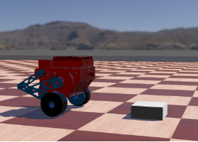

图2 仿真环境中的整车模型

通过使用MATLAB中的lqr函数计算得到反馈增益矩阵K。因为在仿真中主要目的是验证模型建立是否正确，用于计算K矩阵的Q和R权矩阵的数值选取只关注机器人俯仰角的稳定。经检验，得到模型正确。

2 控制器设计

`    `基于本项目的平衡车构型，除了机器人的平移、转向和保持平衡的控制外，还需要控制平衡车双腿的长度及其横滚角。

`    `2.1  LQR控制器

基于上述求得的状态空间方程，通过一个LQR控制器可以较好地对机器人平移、旋转以及机体俯仰角进行控制。

设计控制律为系统状态的线性组合：

u=-Kx=-K11K12K13K14K15K16K21K22K23K24K25K26xx*q*b*q*bϕϕ

通过线性二次型调节器计算反馈矩阵，定义代价函数为

J=0∞xTQx+uTRudt

其中：

- x 是系统状态向量；
- u是控制输入向量；
- Q 是对状态变量的加权矩阵，通常是半正定矩阵，反映了对状态偏离的惩罚；
- R是对控制输入的加权矩阵，通常是正定矩阵，反映了对控制能量的惩罚。

**最优控制律：**

为了使代价函数J达到最小，控制输入 u 应满足以下关系：

u=-R-1BTPx

其中：

- P是代数 Riccati 方程的解。

**反馈增益矩阵：**

通过上述控制律，反馈增益矩阵 K可以表示为：

K=R-1BTP

代数 Riccati 方程**:**

矩阵P需要满足以下代数 Riccati 方程：

ATP+PA-PBR-1BTP+Q=0

其中：

- A 和 B 是系统状态空间方程中的系统矩阵和输入矩阵。

为了可以控制平衡车的移动和转向，还需要实现对位移和偏航角两个状态变量的轨迹跟踪。在系统输入中加入参考输入，即状态期望：

u=-K(x-xd)

其中xd为：

xd=xd000ϕd0

xd为期望位移，ϕd为期望偏航角，两者均由其期望一阶微分量对时间积分得到。

2\.2 双环PID控制器

基于该项目平衡车的四连杆腿部构型，可以通过关节电机的输出来调整机器人的腿部长度；同时，为了让机器人在进行视觉识别时机体保持横滚角水平，还需要根据机器人实时的横滚角值来调整两边腿的长度。

为了让机器人的腿长控制有更快的响应速度和鲁棒性，引入两个双环PID控制器分别对机器人的腿长和横滚角进行控制，最后并行输出到电机控制电流值。

腿长的控制框图如图3所示：

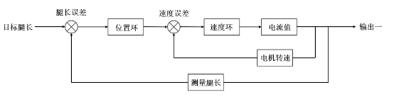图3 机器人腿长双环PID控制框图

横滚角的控制框图如图4所示：

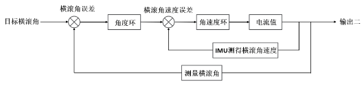

图4 机器人横滚角双环PID控制框图

最终发送的电机电流值为两个控制器的输出之和。

2\.3 增益矩阵K的参数拟合

在建模阶段，我们将倒立摆的杆长假设为定值，但实际上，该值会随着机器人腿长的变化而改变，其对应的模型也会有差异。由于求得解析解较为困难，我们将机器人腿长作为拟合的自变量，对增益矩阵K进行四阶多项式拟合。

由于实车环境下我们无法直接测量机器人实时腿长，需要由一些角度关系推算得到。将模型简化至如图5所示。

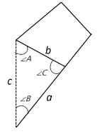

图5 腿部四连杆结构简化模型

其中，三角形边a、边b可以通过在机械图纸中测量得到，角A可以由电机编码器求得，边c则是期望求得的机器人腿长。由余弦定理得式（13）：

a2-b2-c2+2bccosA=0#13

通过MATLAB的solve函数求解（排除负数解）得式（14）：

c=bcosA+a2+b2cos2A-b2#14

经测量，实车边b=0.11291m，边a=0.11461m，将数据代入并由0至90度遍历角A可以得到角A与腿长的关系曲线如图6所示。

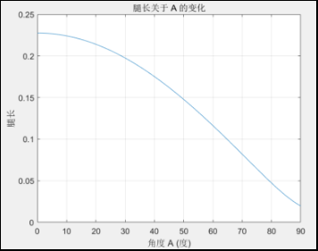

图6 机器人腿长与角度A的关系曲线

在MATLAB中遍历腿长，计算不同腿长值下的增益矩阵K，并对K矩阵每个元素进行关于角度A的多项式拟合，求得拟合系数并存到EXCEL表格中，以便将它们添加进实车代码中进行增益矩阵的实时计算。

拟合公式如式（15）：

y=a4x4+a3x3+a2x2+a1x+a0

其中y对应K矩阵的各个元素，x为测得角度A的值。

最终的拟合效果如图7所示，蓝色曲线为各个角度A值下的实际K矩阵值，紫色曲线为拟合值。

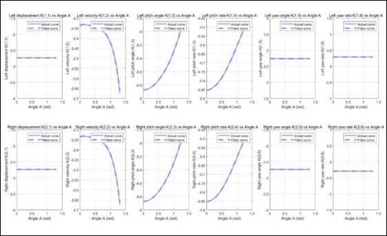

图7 增益矩阵K的实际曲线与拟合曲线对比

通过对比，可知拟合效果满足实车控制需求。

3\. 实车硬件选型及代码框架介绍

基于项目需求及材料储备，本次选取的电控硬件型号如表3所示。

表3 平衡车实车主要电控硬件表

|名称|部分技术参数|功能|数量|
| :-: | :-: | :-: | :-: |
|Robomaster开发板C型|
输入电压：8-28 V

IMU+E-compass：1个

CAN总线接口：CAN1：2个；CAN2：2个

UART接口：2个

SPI接口：1个
|搭载的芯片提供足够高的运算能力，让机器人控制频率保持1000Hz。电机通讯、遥控器信息接收以及视觉电脑通讯|1|
|迈克mc6cmini遥控器航模接收器接收机|
通道数量：6

频率范围：2401-2478 Mhz

控制范围：>800 m
|发送摇杆值，发送机器人平移、旋转、跳跃等指令|1|
|瓴控MG6012E-i8v3伺服电机|
额定电压：48 V

空载转速：310 rpm

额定扭矩：6 Nm

峰值扭矩：16 Nm
|机器人关节电机，控制机器人的腿长以及机体横滚角|2|
|Robomater GM6020电机|
额定电压：24 V

空载转速：320 rpm

额定扭矩：1.2 Nm

峰值扭矩：1.4 Nm
|机器人驱动轮电机，执行平移、旋转、维持平衡等动作|2|
|经纬M600系列TB47S智能飞行电池|容量: 4500 mAh 电压: 22.2 V|整套机器人电控系统的供电|1|
|DC-DC可调电源模块|
输入电压：7-32 V

输出电压：0.8-28 V

恒流范围：0.2-12 A
|为视觉电脑提供适配的工作电压及电流|1|

4\. 实车测试结果与数据分析

对整车多个控制器的控制效果进行分析，除了腿长控制器和横滚角控制器的测试，所有数据测量均在固定腿长的实车状态下测得，对应的增益矩阵K如下所示。数据均在J-Scope中测得，在MATLAB中绘制。

K=-3.693-3.287-8.559-0.5913.6930.369-3.693-3.287-8.559-0.591-3.693-0.369

4\.1 平衡车位移、偏航角静态响应及俯仰角变化

在静止状态下，给机器人位移期望输入幅值为0.4的阶跃信号，其位移响应及俯仰角变化如图8所示。

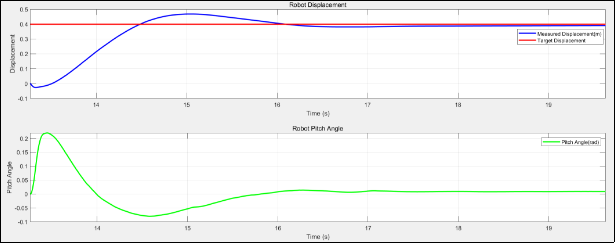

图8 机器人位移阶跃响应及其过程俯仰角变化

经测量，位移响应的峰值时间TP为：

TP=1.731s

超调量s%为：

s%=Amax-AsteadyAsteady×100%=0.468-0.4000.4×100%=17%

调节时间TS为（5%误差下）：

TS=2.542s

在位移状态量的轨迹跟踪过程中，测得机器人机体最大俯仰角为0.219 rad，即约12.549度。

在静止状态下，给机器人偏航角期望输入幅值为1.579（约90度）的阶跃信号，其偏航角响应及俯仰角变化如图9所示。

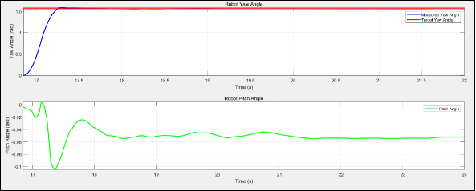

图9 机器人偏航角阶跃响应及其过程俯仰角变化

经测量，位移响应的峰值时间TP为：

TP=0.477s

超调量s%为：

s%=Amax-AsteadyAsteady×100%=1.585-1.5601.560×100%=1.6%

调节时间TS为（5%误差下）：

TS=0.385s

在偏航角状态量的轨迹跟踪过程中，测得机器人机体俯仰角在转动过程中会在0.104 rad内产生小幅度震荡。

综上，机器人位移响应速度较慢，考虑到测量过程中没有加入机器人速度状态的轨迹跟踪，且响应过程中机体倾角较小，实际响应效果可以满足项目需求。偏航角的响应十分迅速，且超调量小，对机体的俯仰角影响十分有限，也能满足项目需求。

4\.2 平衡车腿长及机体横滚角响应

对于机器人腿长的控制，我们采用了双环PID控制器。对腿长目标值输入幅值为0.3的阶跃信号。其位置外环及速度内环的响应曲线如图10所示。

其中，该PID控制器的内外环参数如下所示：

位置环外环：Kp=100,  Ki=0.5,  Intergralmax=10,  Outmax=30;

速度环外环：Kp=0.4,  Ki=0.05,  Intergralmax=5,  Outmax=8;

基于关节电机的扭矩参数，额定扭矩为6N∙m，峰值扭矩为16N∙m，设置常态下速度环的最大速出为8，即8N∙m。

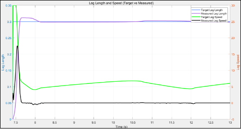

图10 机器人腿长双环控制器的内外环响应曲线

`    `由图10可以看到，速度响应在初始阶段有一段锯齿波形，这是由于机械的腿部涉及有一些干涉导致的。再次输入阶跃信号，其幅值为机器人的最高腿长，其响应曲线如图11所示。

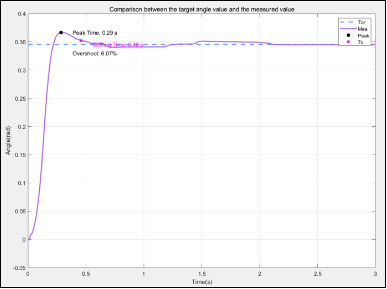

图11 机器人腿长最大阶跃响应曲线

`    `经测量，腿长响应的峰值时间TP为：

TP=0.29s

超调量s%为：

s%=Amax-AsteadyAsteady×100%=0.366-0.3500.350×100%=6.07%

调节时间TS为（2%误差下）：

TS=0.46s

关于机器人横滚角的响应，我们通过让机器人完成单侧上坡的动作来体现。其上坡过程中的横滚角变化曲线及左右腿腿长变化曲线如图12所示。

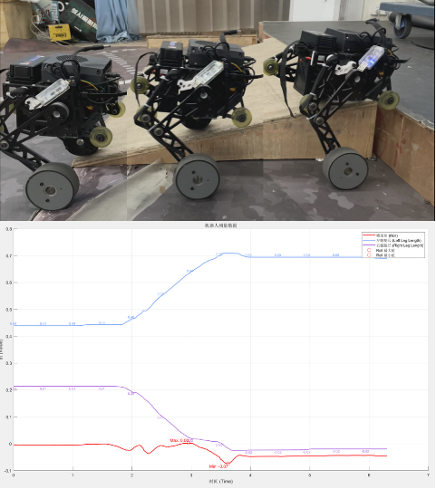

图12 机器人单侧上坡时测得的机体横滚角和两腿长度

`    `由图12可以得到，在单侧上坡过程中，通过横滚角PID控制器控制双边腿长发生改变，来使得机体始终保持横滚角为0。由测得数据可知，该过程中机器人横滚角的变化幅值为0到0.07 rad，该横滚角响应性能满足项目需求。

`    `4.3 离地检测与跳跃动作

`    `在机器人跳跃过程中，机器人整体会完全离开地面，此时其模型与在地面时有差异，这将会导致系统发散。故高效的离地检测与离地处理十分重要。理论上，严谨的离地处理需要通过测得的关节输出扭矩来解算机器人实时受到的支持力，这将需要一定的推导计算。为了项目进度，我们将该流程简化，直接用关节输出扭矩来判断机器人是否离地。图13为机器人两次离地落地的关节扭矩输出，我们选取了离地阈值为0.5Nm，经多次测试，该方式检测离地较为可靠与高效。关于离地后的处理，我们将驱动轮的输出置零，并将位移和偏航角两个状态变量置零，以使得机器人在落地后保持初始状态。

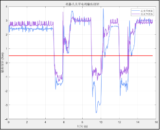

图13 机器人两次离地落地时关节电机输出扭矩曲线

对于机器人跳跃动作的设计，我们通过给腿长期望输入一个幅值较大的脉冲信号实现。实车跳跃过程如图14所示，多次测试测得的平均跳跃高度约为0.1m。受限于机器人较大的机体重量，以目前使用的关节电机输出性能难以实现较高的跳跃高度，其跳跃性能有待提高。图15为机器人在执行两次跳跃动作时腿长控制器双环的输出曲线

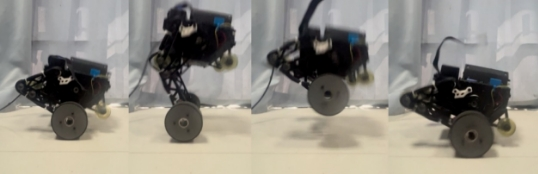

图14 机器人跳跃过程

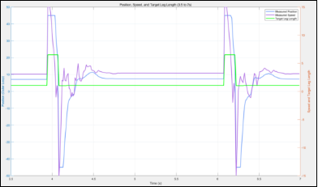

图15 机器人两次跳跃动作过程内外环控制器的输出曲线

